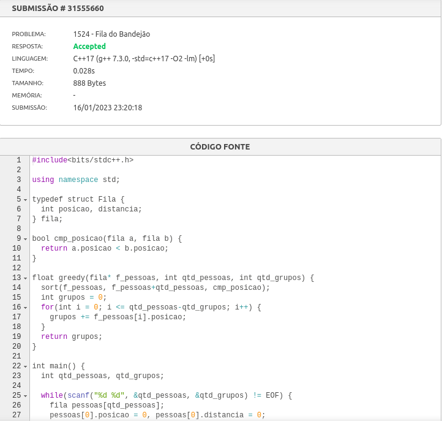
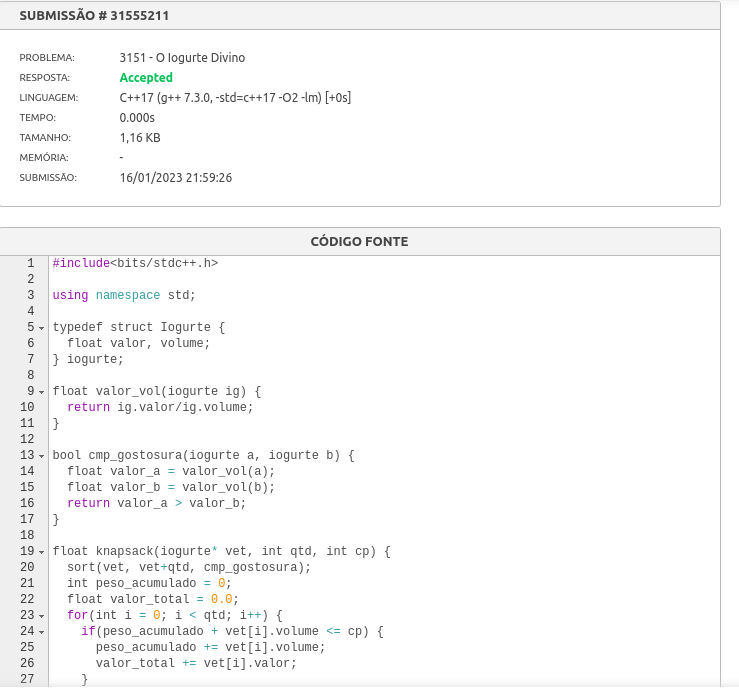

# Exercícios Dupla 23

**Número da Lista**: 23 
**Conteúdo da Disciplina**: Algoritmo Ambiciosos 

## Alunos
|Matrícula | Aluno |
| -- | -- |
| 18/0105256 | Lucas da Cunha Andrade |
| 18/0027352 | Rodrigo Carvalho dos Santos |

## Sobre

Apresentar lista de exercícios de Algoritmos Ambiciosos

## Screenshots

Submissões

*Não possuo submissão para a submissão para o "Minimize Product Sum of Two Arrays" pois ele é liberado somente para o plano premium do Leetcode. Eu obtive o enunciado por um site de terceiros.

## Instalação
**Linguagem**: C++ e JS 

## Uso
Há um README em cada pasta indicando como rodar o código do exercício.

## Outros

[LeetCode 496 - Next Greater Element I](https://leetcode.com/problems/next-greater-element-i/)

[LeetCode 1874 - Minimize Product Sum of Two Arrays](https://leetcode.com/problems/minimize-product-sum-of-two-arrays/)

[LeetCode 1877 - Minimize Maximum Pair Sum in Array](https://leetcode.com/problems/minimize-maximum-pair-sum-in-array/)

[Beecrowd 1524 - Fila do Bandejao](https://www.beecrowd.com.br/judge/pt/problems/view/1524)

[Beecrowd 3151 - O Iogurte Divino](https://www.beecrowd.com.br/judge/pt/problems/view/3151)

